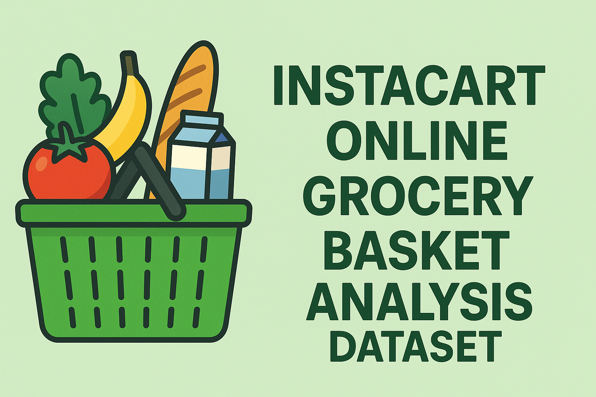
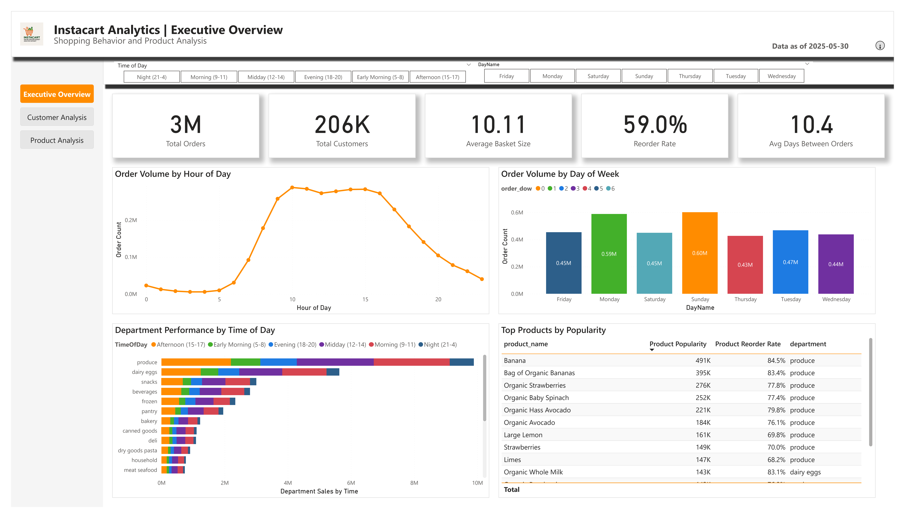
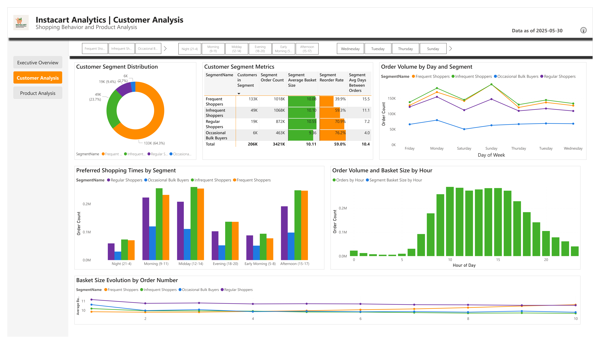
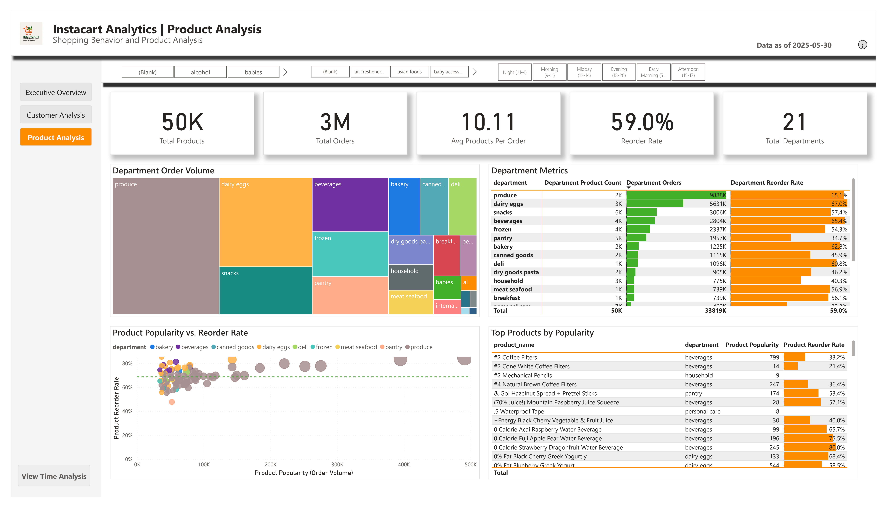

# Instacart Online Grocery Analysis



## Project Overview

This end-to-end data engineering and analytics project analyzes Instacart online grocery shopping data to uncover customer purchasing patterns, product performance, and shopping behaviors. By examining over 3 million grocery orders from more than 200,000 Instacart users, this project delivers actionable insights through interactive Power BI dashboards aimed at optimizing inventory management, marketing strategies, and enhancing the overall customer experience.

## 📊 Dashboard Screenshots

### Executive Overview Dashboard


### Customer Analysis Dashboard


### Product Analysis Dashboard


## ⚠️ Important Note on Data Files

**Due to GitHub's file size limitations, the raw data files (exceeding 100MB) could not be uploaded to this repository.**

To reproduce this analysis, please download the "Instacart Market Basket Analysis" dataset from Kaggle:
[https://www.kaggle.com/datasets/yasserh/instacart-online-grocery-basket-analysis-dataset?resource=download](https://www.kaggle.com/datasets/yasserh/instacart-online-grocery-basket-analysis-dataset)

Place the downloaded CSV files in the `1_data/raw/` directory before running any scripts.

## 📂 Repository Structure

```
instacart-analytics-project/
├── 1_data/                  # Raw and processed data files
│   ├── raw/                 # Original Kaggle dataset
│   └── processed/           # Cleaned and transformed data
│
├── 2_code/                  # All code files
│   ├── python/              # Python scripts (PyCharm)
│   │   ├── data_cleaning.py
│   │   ├── exploratory_analysis.py
│   │   └── feature_engineering.py
│   │
│   ├── sql/                 # SQL scripts (SSMS)
│   │   ├── schema_creation.sql
│   │   ├── data_loading.sql
│   │   └── analysis_queries.sql
│   │
│   ├── pyspark/             # PySpark scripts (Docker)
│   │   ├── Dockerfile
│   │   ├── requirements.txt
│   │   └── spark_processing.py
│   │
│   └── databricks/          # Databricks notebooks
│       ├── data_ingestion.py
│       ├── advanced_analytics.py
│       └── machine_learning.py
│
├── 3_azure/                 # Azure configuration
│   └── arm_templates/
│       └── adf_pipelines/
│
├── 4_visualizations/        # Power BI files
│   ├── instacart_analysis.pbix
│   └── dashboard_designs/
│
└── 5_documentation/         # Project documentation
    ├── project_overview.md
    ├── data_dictionary.md
    ├── technical_implementation.md
    └── business_insights.md
```

## 🚀 Project Development Journey

### 1. Project Planning & Data Understanding
- Defined business objectives: understanding customer behavior, product performance, and shopping patterns
- Downloaded and explored the Instacart dataset from Kaggle
- Created project architecture and infrastructure requirements
- Developed detailed data dictionary and entity-relationship diagrams

### 2. Data Engineering Phase
- **Data Ingestion**: 
  - Set up Azure Data Factory pipelines to ingest data
  - Implemented data quality checks and error handling
  
- **Data Processing**:
  - Python scripts for data cleaning and feature engineering
  - PySpark jobs for large-scale transformations
  - SQL procedures for relational data modeling

- **Data Storage**:
  - Designed multi-layer architecture (bronze/silver/gold)
  - Optimized storage with proper partitioning and indexing

### 3. Analytical Processing
- Performed exploratory data analysis using Python/Pandas
- Developed customer segmentation model using k-means clustering
- Built product affinity analysis with association rules
- Created time-pattern analysis for order scheduling
- Applied machine learning for reorder prediction

### 4. Visualization Development
- Power BI dashboard design with three main pages:
  - Executive Overview: KPIs and high-level trends
  - Customer Analysis: Segment behavior and patterns
  - Product Analysis: Performance metrics and associations
- Implemented custom DAX measures for advanced calculations
- Optimized visuals for interactivity and performance
- Created custom tooltips and drill-through experiences

### 5. Quality Assurance & Documentation
- Performed cross-validation of calculated measures
- Fixed visualization issues and optimized DAX formulas
- Created comprehensive documentation including:
  - User guide for dashboard navigation
  - Technical implementation details
  - Data dictionary and model documentation

## 🔧 Technologies Used

- **Programming Languages**: Python, SQL, DAX, M Query
- **Big Data Processing**: PySpark, Databricks
- **Cloud Services**: Azure (Data Factory, Blob Storage, SQL DB)
- **Data Analysis**: Pandas, NumPy, Scikit-learn
- **Visualization**: Power BI Desktop
- **Version Control**: Git/GitHub
- **Development Environments**: PyCharm, VS Code, SQL Server Management Studio

## 💡 Key Insights

- **Customer Behavior**:
  - Identified 4 distinct customer segments with unique shopping patterns
  - 41% of customers show consistent weekly shopping patterns
  - New customers focus on essentials before expanding to specialty items

- **Product Performance**:
  - Fresh produce and dairy have highest reorder rates (68% and 62% respectively)
  - Certain products show strong time-of-day purchase patterns
  - Department popularity varies significantly by day of week

- **Shopping Patterns**:
  - Peak ordering hours: 10am-11am and 2pm-4pm
  - Weekend orders have 30% larger basket sizes
  - Most reorders occur within 7-10 days of previous purchase

## 🏁 Getting Started

### Prerequisites
- Python 3.8+
- SQL Server or Azure SQL
- PySpark environment or Docker
- Power BI Desktop

### Installation & Setup
1. Clone this repository
2. Download the Instacart dataset from Kaggle and place in `1_data/raw/`
3. Set up Python environment: `pip install -r 2_code/pyspark/requirements.txt`
4. Run data processing scripts in sequence:
   ```
   python 2_code/python/data_cleaning.py
   python 2_code/python/exploratory_analysis.py
   python 2_code/python/feature_engineering.py
   ```
5. Execute SQL scripts in `2_code/sql/` directory to set up database
6. Open Power BI files in `4_visualizations/` to explore dashboards

## 📝 Future Enhancements

- Implement real-time data processing with Azure Stream Analytics
- Develop predictive models for inventory optimization
- Create mobile-optimized dashboard views
- Integration with customer demographic data for richer segmentation

## 👤 Author

- **Tushar Dhawale** - [GitHub Profile](https://github.com/tushardhawale123)

## 📄 License

This project is licensed under the MIT License - see the [LICENSE](LICENSE) file for details.

---

*Last updated: May 31, 2025*
```
